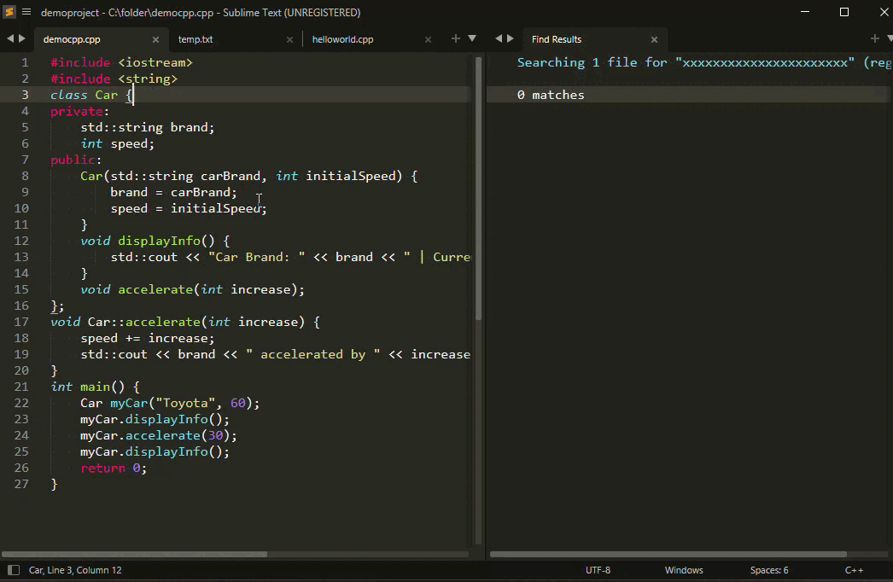

demo video




```
bug report, pr, feature request, review welcome
2026Sep
  change/addfeature
    disable function cmd nextbookmark openfileneeded part
    disable function cmd clearall    for now
    store line snippet
    list proj bookmarks w/ symbols (func/method name)
    symlist if bookmarks exist under each    https://blog.thul.org/technik/downloads/symlist-clickable-function-list-for-sublime-text/
    edited file, File>Revert
    add bookmark, close st, file content overwritten externally (repo git ops), open
    don't edit, add bookmark only, st stay open, file content overwritten externally (repo git ops) (st auto reload)
    at view close; deny save prompt
    unmatched bookmarks at revert/extmod are archived, hinted at status bar
    list archived bookmark cmd panel
    add text, add bookmark, close st, open, undo to del added text
    update splitviews when toggle bookmark in either
    search show all matching lines of current in archiveview
  bugsreported
    -

  test  commented commits should run, never get forcepsuhed    \Sublime Text 4 x64\Data\Packages
  dev   numbered commits may not run, often get forcepushed

  todo priority
    demo vid git checkoutsoft, archive feature
    add man cmd - backup project bookmarks
    >6mo dist packagecontrol
  todo long
    ?status show bookmark count within selection?  cautious blocking on_selection 
    add man cmd - clear archive, clear hot, clear project     confirm
    bookmarks store lcoation options
      programfile/package  /.json                          <remain the same for now
      sublime-project      window.set_project_data( d) <notplanned
      per file overridedatafile, next to the actual, use if check exist
        allow diff proj, same bookmarks; allow rename folder; git man the datafile
        cautious public repo data leak
    save at least two versions perfile?                              see also "<tricky" 
      DONE SCOPE0HOT        sync to (kind of) buffer, to handle splitview    https://www.sublimetext.com/docs/api_reference.html#sublime.Buffer
      DONE SCOPE1FILETIME   sync to actual file (timestamp), to handle extmod and revert
      gitcommitnumber based,    ?detect isunstaged? conflict filetimestamp
      not for now           optionally per view
    ?should auto check and restore from archive? current manually only
  other notplanned; done
    gui action utests < too complex, notfornow
    plain json 
      notplanned bookmarks storage at sublime-worksp/project
      textedit freedom eg after proj and folder rename
  notes py; notes st
    :=  [] {} 0 falsy is/not None   py 3.8
    View(st class).custommethod= def    per session
    these persist across st close; but cleared at buffer end == last tab/view close (==.sublime-worksp/project internally)
      view.settings().get/set()
      view.custom1=
    doesn't work get/setattr(view, "CUSTOM1", 1)
    don't camel<>underscore   class NocamelyestextsearchCommand(sublime_plugin.TextCommand):  #run_command('nocamelyestextsearch'
    don't view.id()     int recycle;     set().add(vid)  seems not working  
    do not trust AIs
      wrong logic  st event, lifecycle, data lifespan and scope
      wrong api syntax sometimes
  st4 observations, incomplete,         < tested only with  habit at least one project longrunning
    summary
      file content sync w         buffer
        when content externally changed/user revert, if prompt buffer discard confirmed, retains vanilla bookmark(view), but removes gutterregions (view)
      gutterregions sync w        view            <bookmark
      vanilla bookmark  sync w    view
      plugin.py init with         session
      events
    sublimeapistudy.py
      powershell sublimeapistudy_log.txt read
      testgutterregions   .sublime-keymap   { "keys": ["f9"], "command": "e1"},
    observe
      text edit /view.dirty
      gutterregions         < view.add_regions(   < sync view, not shared by SplitView views
      vanilla bookmark                            < sync view,  ..
    behavior
      insert
        auto adjust regions
        auto adjust vanilla bookmark
      undo insert to del somehow (dirty, exit st, open, undo)    < DONE on_text_command revive bookmarks after undo cmd unconditionally
        somehow del regions
        somehow del vanilla bookmark
      del                                                  <ignore,  user can decide with togglecmd
        no yet known logic retain regions 
        no yet known logic retain vanilla bookmark
      undo del to ins somehow                               <ignore for now
        somehow restore regions
        somehow restore vanilla bookmark
      at st close; restart
        save, load dirty                               <not tested when file external changed,ignore for now
        discard regions
        save, load vanilla bookmark
      at project close; open
        save, load dirty                               <not te..
        discard regions
        save, load vanilla bookmark
      at File>Open                              <on_load
        no regions
        no vanilla bookmark
      at tab rightlick > SplitView
        inherit and sync dirty
        no regions inherit                       < on_activated{     DONE
        no vanilla bookmark inherit
      at file save                          <on_post_save     <diskwrite 
        consol edit
        nochange regions
        nochange vanilla bookmark
      at view close (click tab X)
        discard regions
        discard vanilla bookmark                                  < feature most wanted by sublimetexters
      at view close; deny save prompt                            <tricky, DONE
        retain dirty , if not last view of file after SplitView
        discard dirty, only if last 
      while file open; content overwritten external                 < on_reload  on_reload_async
        auto load if not dirty
        prompt discard if dirty,   undoable restore regions
        discard regions                                             <tricky  DONE
        save, load/ try sync   vanilla bookmark
      File>Revert                                                <on_revert  on_revert_async 
        discard regions                                               <tricky DONE
        save, load/ try sync   vanilla bookmark
    api
      at st start; hot reload   plugin.py edit/save
        exec plugin.py root
        plugin_load()     view/window may not init yet
        plugin.py class on_init
      at st start
        opens last project(s) (to test multi projects   File>Exit)
        NO load_project   even if multi
        NO on_load
        on_activated  x1
      at ins,del                                      <nochange
      lostfocus                      on_deactivated   <diskwrite
      gainfocus                      on_activated
      at st close; and at project close
        on_pre_close_project        views[]           <diskwrite
        on_pre_close(view) etc       cautious  redundnat exec
      at tab rightlick > SplitView
        1 on_deactivated    curent
        2 on_activated      newsplitview  same file_name()
        NO on_load
      File>Open
        1 on_activated
        2 on_load
      ONLY triggered by
        load_project
          File>Project>Open project
        on_load
          File>Project>Open project
          File>Open
    cmd
      toggle                                            <diskwrite
      genlist                                            <diskwrite
  mp4gifgithub
    https://bnhr.xyz/2018/01/05/make-a-gif-from-a-video-using-ffmpeg-and-imagemagick-on-linux.html
    https://usage.imagemagick.org/anim_basics/
      ffmpeg -i III.mp4 -r 10 FFF/frame-%03d.png
      magick  -delay 10 -loop 0 -layers Optimize FFF/*.png FFF/OOO.gif

      C:\portable\ffmpeg-7.1-essentials_build\bin\ffmpeg.exe -i demo1.mp4 -r 10 C:\persist\desktop\t/frame-%03d.png
      "C:\Program Files\ImageMagick-7.1.2-Q16-HDRI\magick.exe"  C:\persist\desktop\t/*.png -delay 10 -loop 0 -layers Optimize C:\persist\desktop\t/demo1.gif
    or
      ffmpeg -i <input.mp4>  -r 10 -f image2pipe -vcodec ppm - | convert -delay 10 -loop 0 -layers Optimize - <output.gif>
```